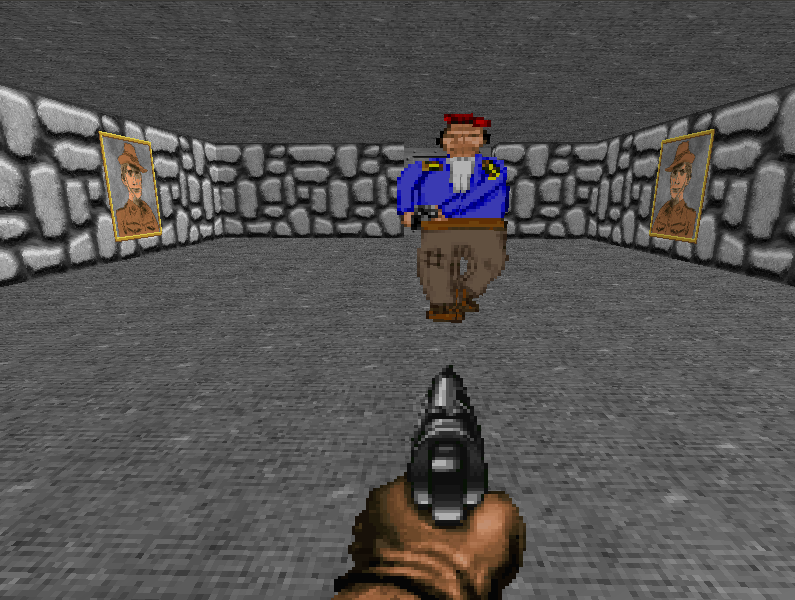

# Prism

A 3D game engine written in Crystal!

This project was largely inspired by ["The Benny Box"](https://www.youtube.com/channel/UCnlpv-hhcsAtEHKR2y2fW4Q) and his [3D Game Engine Tutorial](https://www.youtube.com/watch?v=ss3AnSxJ2X8&list=PLEETnX-uPtBXP_B2yupUKlflXBznWIlL5&index=1). Thanks for all the good tutorials Benny!

This is a work in progress as I follow tutorials and wrap my head around game development.

## Demo
[This is a demo game](https://youtu.be/-IyXs2Dqs2o) that I hacked together using another tutorial. The source is under `samples` but be warned the code is quite ugly. This game simply illustrates that the engine actually works even with it's limited feature set.

[](https://youtu.be/-IyXs2Dqs2o)


## Installation

Add this to your application's `shard.yml`:

```yaml
dependencies:
  prism:
    github: neutrinog/prism
```

Install GLFW on your system


```bash
# on linux
sudo apt-get install libglfw3-dev

# on macOS
brew install glfw3
```

## Usage

```crystal
require "prism"
```

> TODO: write some usage example here.

For now you can run the same application in this repo.

```bash
make start
```

> NOTE: You might need to manually make the c lib `cd src/prism/lib && cmake . && make`.
> I guess the shard `postinstall` script only runs if you are installing this as a dependency (annoying).

## Development

TODO: Write some half-decent development instructions here.

There is some temporary c code that needs to get compiled with the engine. My top priority is to get all c compilation outta here so we can enjoy pure crystal code! In the mean time you'll need to install cmake first.

- install [cmake](https://cmake.org)
- install freeglut `sudo apt install freeglut3 freeglut3-dev`
- install opengl `sudo apt install mesa-common-dev`
- install [crystal](https://crystal-lang.org/)

Supporting libraires I've built/forked-and-modified for this project:

- [CrystGLUT](https://github.com/neutrinog/cryst_glut) - an OpenGL context toolkit that leverages [Freeglut](http://freeglut.sourceforge.net/).
- [LibGLUT](https://github.com/neutrinog/lib_glut) - [Freeglut](http://freeglut.sourceforge.net/) bindings for Crystal with some custom bindings of my own to support passing closure from Crystal to C.
- [LibGL](https://github.com/neutrinog/cryst_glut) - OpenGL bindings for Crystal.

## Contributing

I'm using this as a learning exercise by following along with [this tutorial](https://www.youtube.com/watch?v=ss3AnSxJ2X8&list=PLEETnX-uPtBXP_B2yupUKlflXBznWIlL5&index=1). But if you are super interested send me a message so we can coordinate maybe?

1. Fork it (<https://github.com/neutrinog/prism/fork>)
2. Create your feature branch (`git checkout -b my-new-feature`)
3. Commit your changes (`git commit -am 'Add some feature'`)
4. Push to the branch (`git push origin my-new-feature`)
5. Create a new Pull Request

## Contributors

- [neutrinog](https://github.com/neutrinog) Joel Lonbeck - creator, maintainer
